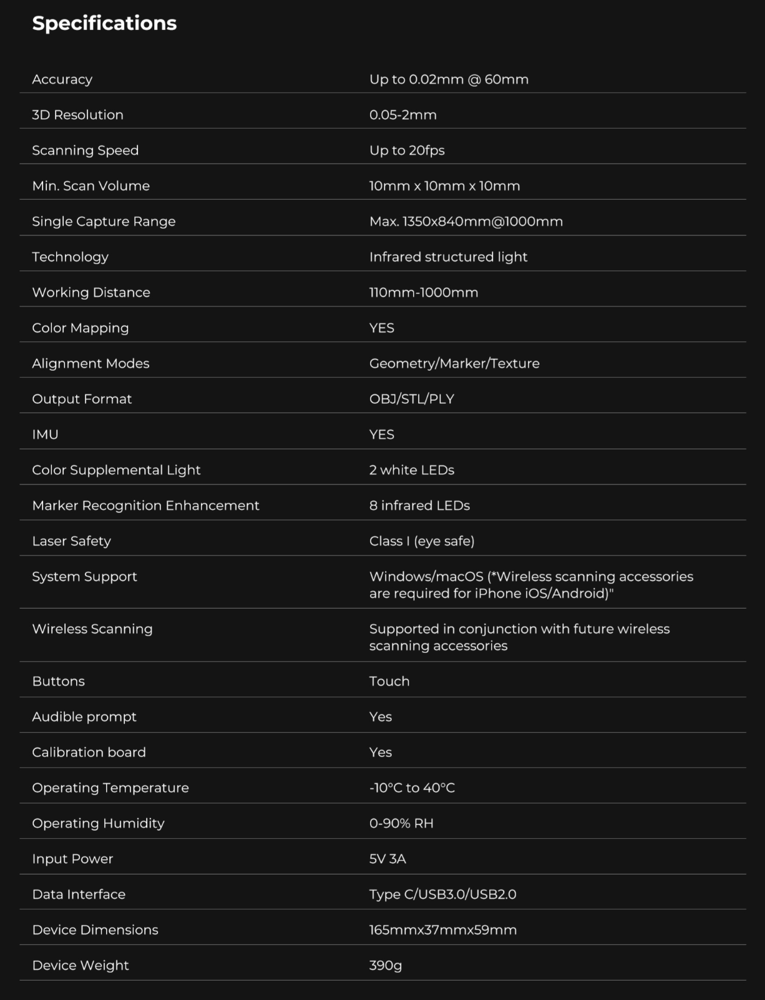
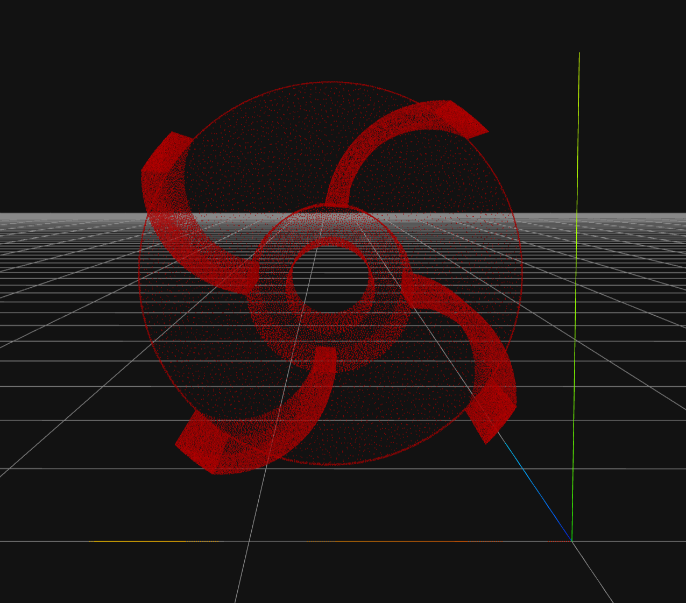
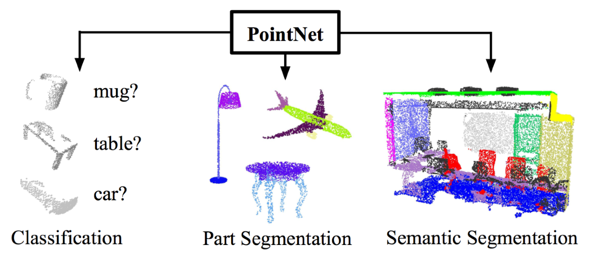
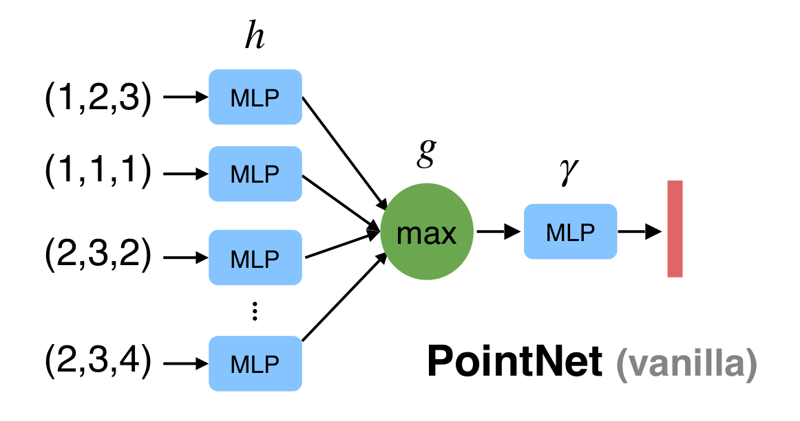
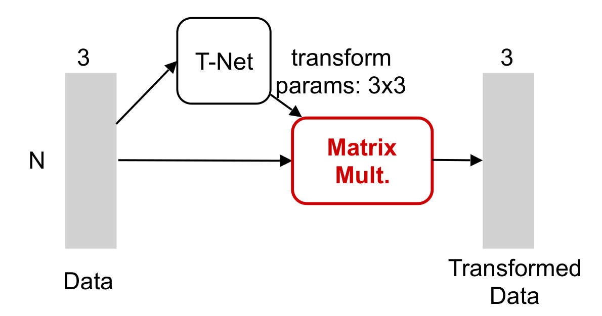
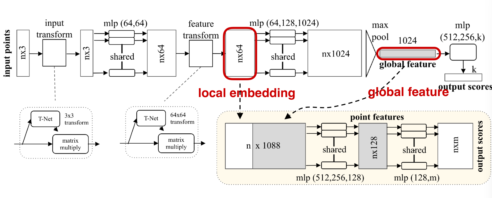
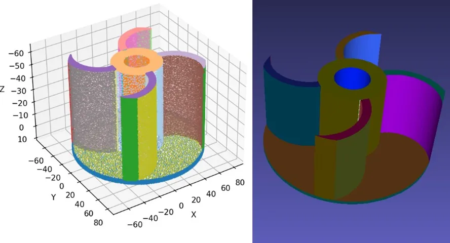
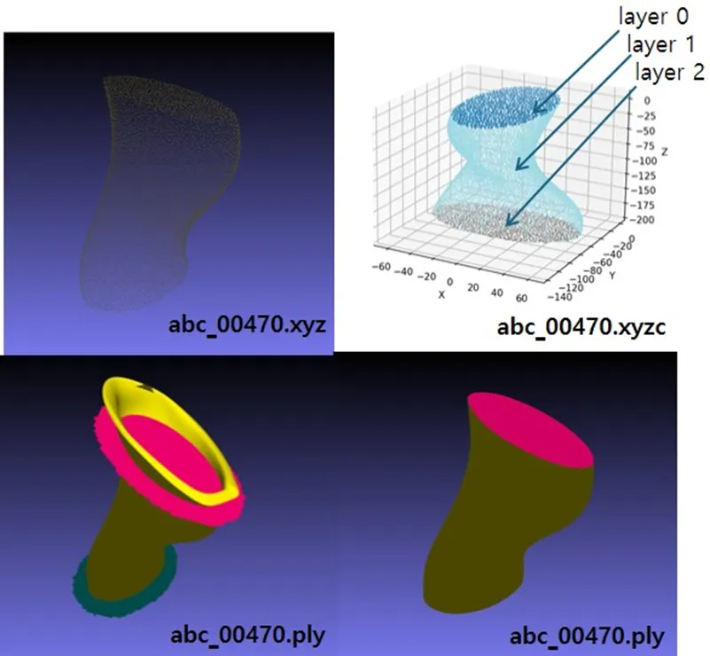
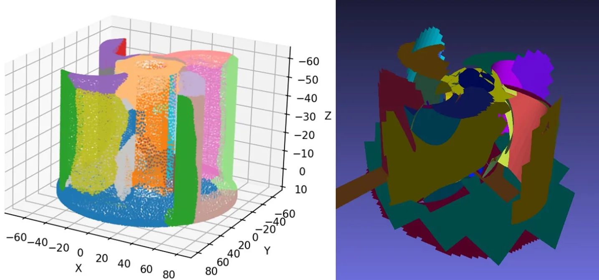

# 2025-09-29 AI 바우처 현장방문

## 데이터 수집 및 정제 작업

- 원시 데이터는 0.02mm 정확도의 구조화 광 스캐너(CR-Scan Otter)로 
산업용 부품 3종(임펠러, 케이싱, 샤프트)을 스캔하여 획득함




- `.xyz` 원시데이터

```text

3.239405 77.232046 6.879021
38.206466 31.156267 6.879021
-26.172745 2.466757 6.879021
51.295421 20.139613 6.879021
-8.786664 -41.236169 6.879021
...중략

```



- 원시데이터는 PointNet의 입력으로 사용됨

## PointNet의 핵심 아이디어와 아키텍처

- PointNet은 포인트 클라우드(Point Cloud) 데이터에서 직접적으로 효과적인 특징 학습을 달성한 모델
- 흩어져 있고 순서가 없는 포인트 데이터에 대해 end-to-end 학습을 수행
- Object Classification, Semantic Segmentation, Part Segmentation 등
다양한 3D 작업에 적용할 수 있는 통합된 아키텍처를 제안



### 순서가 없는 데이터 처리

- 포인트 클라우드는 점들의 '집합'이므로 점들의 순서가 바뀌어도 동일한 집합을 나타냄
- 따라서 신경망은 입력 순서에 영향을 받지 않아야 함
- 각 포인트를 독립적으로 고차원 공간에 임베딩하고,
Max Pooling을 통해 모든 포인트의 정보를 하나의 전역 특징 벡터로 통합함



### 기하학적 변환에 불변

- 객체를 회전하거나 이동해도 동일한 객체로 인식해야 함
- Transformer Network(T-Net)이라는 보조 네트워크를 사용하여
입력된 포인트 클라우드에 대한 최적의 변환 행렬을 예측함
- 최적의 변환 행렬을 적용하면 일관된 표준 공간(Canonical Space)으로 정렬할 수 있음



## PointNet 모델 아키텍처

### 분류 아키텍처 (Classification Architecture)

1. 입력된 포인트 클라우드는 T-Net을 통해 정렬됨
2. 각 포인트는 MLP를 통해 고차원 임베딩 공간으로 변환됨
3. 특징 공간에서도 T-Net을 통해 한 번 더 정렬됨
4. Max Pooling을 통해 모든 포인트의 정보를 통합하여 객체 전체를 나타내는 전역 특징 벡터를 추출함
5. 전역 특징 벡터를 통해 최종적으로 객체를 분류함


### 분할 아키텍처 (Segmentation Architecture)

1. 각 포인트의 지역 임베딩과 전체 객체의 전역 특징 벡터를 결합함
2. 결합된 정보를 사용하여 각 포인트가 어느 부분에 속하는지 예측함



## PointNet 학습 전략

1. 경계부와 소규모 구조 등 난이도가 높은 표본에 대한 손실 기여도를 증폭시키는 Focal Loss를 사용함
2. 역빈도 가중치를 손실 함수에 도입하여 클래스 불균형 상황에서도 소수 클래스를 충분히 학습함
3. 레이어 단위 선처리 지도 데이터 구축 알고리즘을 설계하여 포인트 클라우드 데이터를 구조적으로 단순화하고 피팅 가능한 표면 단위로 분해함


<br>



## Point2CAD의 핵심 아이디어

- Point2CAD는 포인트 클라우드 데이터를 엔지니어링 설계에 즉시 사용할 수 있는
위상적으로 완벽한 CAD 모델(B-rep 형식)로 자동 변환함
- 자유 곡면을 정교하게 재구성하기 위해 암시적 신경망 표현 (Implicit Neural Representations)을
도입하여 기존 기술의 한계를 극복함


## Point2CAD의 파이프라인

### 1. 포인트 클라우드 분할 (Segmentation)

- PointNet 사용

### 2. 표면 맞춤 (Surface Fitting)

- 단순 도형: 기하학적으로 단순하고 규칙적인 표면(평면, 원기둥, 구, 원뿔 등)에
대해서는 전통적 기하 프리미티브 피팅을 적용
- 자유 곡면: INR을 활용하여 자유 곡면을 수학적으로 정의함. 
데이터가 없는 영역까지 매우 부드럽고 자연스럽게 확장할 수 있음


### 3. 위상 재구성 (Topology Reconstruction)

- 모서리(Edge) 생성: 2단계에서 수학적으로 완벽하게 정의된 인접한 두 면(Surface)을
서로 교차시켜 교차선, 즉 모서리를 계산함
- 꼭짓점(Corner) 생성: 계산된 모서리들을 다시 서로 교차시켜 꼭짓점을 찾음
- 최종 모델 완성: 이 모서리와 꼭짓점을 기준으로 각 면을 깔끔하게 잘라내어,
기하학적 정보(Geometry)와 위상 정보(Topology)가 모두 포함된 완벽한
B-rep(Boundary Representation) 모델을 완성함
- B-rep 모델: 완벽한 기하학적 정보(Geometry), 명확한 위상적 관계(Topology),
즉시 편집 가능한 Parametric 특성


## Workflow Summary



## Contribution

### 표준 프리미티브(plane, sphere, cylinder, cone) 기반 피팅의 불안정성 극복

자동 재구성 과정에서 Point2CAD는 우선적으로 기본 도형을 적합시켜 표면을 정의한다.
그러나 비정형 형상을 갖는 산업용 부품에서는 이러한 프리미티브에 대응되는 명확한 특징점이 부족하거나,
전반적 형상 오차가 커져 표면 정의가 부정확해지는 사례가 반복적으로 나타남


### 기하학적 복잡도 증가에 따른 과대 단순화(over-simplification) 문제 극복

형상이 복잡해질수록 피팅으로 정의되는 개별 표면(레이어)의 수가 유의하게 감소하는 경향이 있다.
레이어 수 감소는 나사산, 미세 굴곡 등 핵심 특징의 소실을 초래하며,
경계가 불분명해져 물체가 불필요하게 연결되거나 과도하게 확장 해석되는 등 구조적 왜곡으로 이어진다.
더 나아가, 이후의 토폴로지 기반 경계 표현 단계에서도 이러한 오류가 충분히 보정되지 않은 채 최종 결과로 전파되는 한계가 확인된다.



## 성능지표

### 절대 위치 정확도

두 모델의 전역 좌표계상 위치 오차를 평가하는 지표로, 각 모델의 축 정렬 경계 상자(AABB; Axis-Aligned Bounding Box) 중심점 간 좌표축별(X, Y, Z) 차이 벡터의 평균과 최댓값으로 산출하였다.

$$
\frac{1}{|P|+|Q|} \Big( \sum_{p \in P}min_{q \in Q} ||p-q|| + \sum_{q \in Q}min_{p \in Q} ||q-p|| \Big)
$$

- P : 기준(reference) 메쉬에서 샘플링한 점 집합(point cloud)
- Q : 비교 대상(target) 메쉬에서 샘플링한 점 집합
- p∈P : 기준 메쉬의 한 점
- q∈Q : 대상 메쉬의 한 점
- 기준 점군P의 각 점에서 대상 점군Q까지의 최근접 거리를 모두 합산
- 대상 점군Q의 각 점에서 기준 점군P까지의 최근접 거리를 모두 합산
- 두 합을 더한 뒤, 전체 점 개수로 나눔

---

### 상대 위치 정확도

두 모델을 각각 점군으로 변환하고 초기 중심을 일치시킨 후, ICP(Iterative Closest Point) 알고리즘을 통해 정밀 정합을 수행하였다. 정합 완료 후, 두 점군 간 최근접 거리를 양방향으로 측정하여 산출된 평균(Symmetric Chamfer Distance) 및 최대(Hausdorff Distance) 오차를 통해 상대적 형상 일치도를 평가하였다.

$$
\frac{1}{|d|}\sum_{u \in d} u
$$

- d: 두 점군(Point Cloud) 사이에서 구한 최근접 거리들의 집합
- u: 집합d안에 들어 있는 각각의 개별 거리값
- 두 점군 사이의 모든 점들이 서로 얼마나 가까운지를 계산하고
- 그 값들의 평균을 내서 두 형상이 얼마나 잘 맞는지를 수치로 나타낸 것

---

### 길이 측정 정확도

모델의 외관 치수 정확성을 검증하기 위해 각 모델의 주축 정렬 경계 상자(OBB; Oriented Bounding Box)를 기준으로 가로, 세로, 높이를 측정하고, 기준 모델 대비 축별 길이 오차를 계산하였다.

$$
\frac{|L_{1x}-L_{2x}| + |L_{1y}-L_{2y}| + |L_{1z}-L_{2z}|}{3}
$$

- $L1x$, $L1y$, $L1z$: 메쉬1의 축별 길이
- $L2x$, $L2y$, $L2z$: 메쉬2의 축별 길이(x, y, z 방향)

---

### 기하학적 정확도와 표면 일치도

모델 표면 전체의 형상 유사도를 측정하는 지표이다. 각 모델 표면에서 균일하게 샘플링된 점군 간의 양방향 평균(Chamfer Distance) 및 최대(Hausdorff Distance) 거리와, 기준 모델에서 결과 모델로의 단방향 평균 거리를 계산하여 종합적으로 평가하였다.

$$
\frac{1}{2} \bigg( \frac{1}{|P|} \sum_{p \in P} d(p, Q) + \frac{1}{|Q|} \sum_{q \in Q} d(q, P) \bigg)
$$

- d(p,Q): 점p∈P에서 점군Q까지의 최근접 거리
- d(q,P): 점q∈Q에서 점군P까지의 최근접 거리
- 양방향 평균을 구해서 대칭적인 거리 척도를 만든 것

$$
\frac{1}{|P|} \sum_{p \in P} min_{q \in Q} ||p - q||
$$

- min q∈Q​∥p−q∥: 점p에서 대상 점군Q까지의 최근접 거리
- 기준 점군P의 각 점에 대해, 대상 점군Q에서 가장 가까운 점까지의 거리를 구
한다.
- 이렇게 구한 모든 최근접 거리를 더한 후, 점 개수P로 나눈다

---

### 형상 편차 시각화

제조업의 일반적인 형상 공차 관리 기준(ISO 10360-8)에 근거하여 평균 편차를 0.2 mm 이하로 관리하는 것을 목표로 하였다.

$$
\frac{1}{2} \Bigg(\frac{1}{|P|} \sum_{i=1}^{|P|} min_{q \in Q} ||p_i - q || + \frac{1}{|P|} \sum_{j=1}^{|Q|} min_{p \in P} ||q_j - p || \Bigg)
$$

- 평균 양방향 최근접 거리 공식 기반
- 두 점군이 서로 얼마나 겹치는지를 나타내는 대표적 지표
- 값이 작을수록 두 메쉬/점군이 잘 정합됨

