# 2025-09-17 Lab Meeting

- Topic: Camera Matrix

## Introduction

카메라 행렬(Camera Matrix)은 월드 공간(World Space, World Coordinate System)의
한 점이 어떻게 이미지에 매핑되는지를 알려준다. 카메라 행렬은 Intrinsic Matrix와 Extrinsic Matrix로 나뉜다.

### Intrinsic Matrix: 카메라의 내부 파라미터를 포함하는 행렬

$$
K = \begin{bmatrix}
f_x & 0 & c_x \\
0 & f_y & c_y \\
0 & 0 & 1
\end{bmatrix}
$$

### Extrinsic Matrix: 카메라의 외부 파라미터를 포함하는 행렬

$$
R = \begin{bmatrix}
r_{11} & r_{12} & r_{13} \\
r_{21} & r_{22} & r_{23} \\
r_{31} & r_{32} & r_{33}
\end{bmatrix}
$$

$$
T = \begin{bmatrix}
t_x \\
t_y \\
t_z
\end{bmatrix}
$$

## 핀홀 카메라(Pinhole Camera)

우리는 실제 카메라의 행렬을 찾고 싶지만, 그런 카메라들은
렌즈를 통과하는 빛의 양을 조절하는 구멍인 조리개가 크고 렌즈가 많아서 분석하기가 매우 복잡하다.
그래서 실제 카메라를 모델링하는 대신, 우리는 핀홀 카메라라는 단순화된 모델을 사용한다.
이상적인 핀홀 카메라는 무한히 작은 조리개를 가지고 있으며, 이는 단지 하나의 점으로 표현된다.
그 결과, 이미지 평면, 즉 센서의 각 점에는 단 하나의 방향에서 오는 빛만이 도달하게 된다.

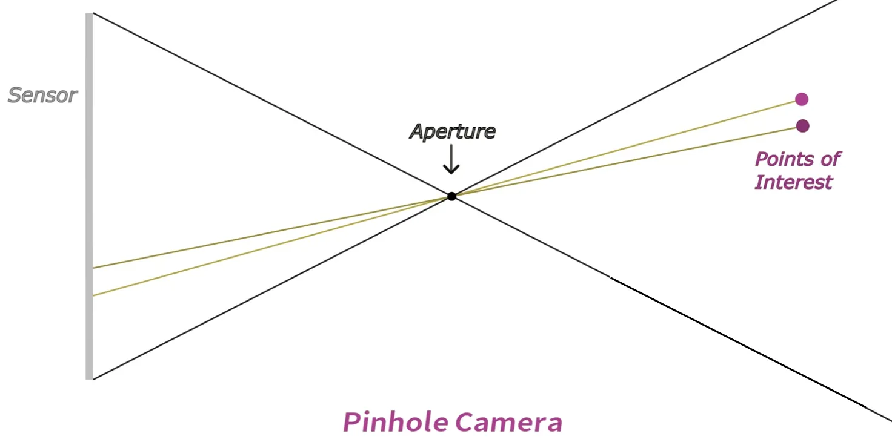

만약 조리개가 더 크다면, 여러 방향에서 온 빛이 센서의 한 점에 도달하게 될 것이고,
그것은 이미지를 흐리게 만들 것이다. 실제 카메라들은 더 큰 조리개를 가지고 있으며,
이러한 흐림 현상을 방지하거나 줄이기 위해 렌즈를 사용한다.
하지만 렌즈는 방사 왜곡(radial distortion)이나 접선 왜곡(tangential distortion)과 같은 오차를 발생시키며,
이러한 오차들은 핀홀 모델로는 포착되지 않는다.

- **방사 왜곡**: 렌즈의 중심에서 멀어질수록 이미지가 볼록하게 튀어나오거나 오목하게 들어가는 현상
- **접선 왜곡**: 렌즈와 이미지 센서가 완벽하게 평행하지 않아서 이미지가 한쪽으로 기울어지거나 늘어나 보이는 현상

오차들은 좋은 카메라와 렌즈를 사용한다면 보통 무시할 수 있을 정도로 매우 작다.
따라서 핀홀 모델은 간단하고 상당히 정확하기 때문에 매우 유용한 모델이다.

## 월드 좌표계와 카메라 좌표계(World and Camera Coordinate System)

보통은 x축과 y축이 지면을 형성하고 z축이 위를 향하는 형태를 가진다.
하지만 카메라 작업을 할 때는 센서가 x축, y축과 정렬되어 있고
카메라는 양의 z축 방향을 바라보는 좌표계를 사용하는 것이 일반적이다.

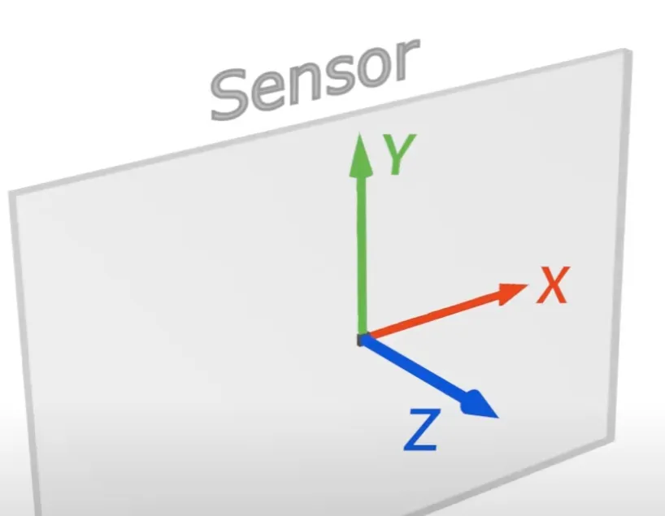

z축은 광축(optical axis) 또는 주축(principal axis)과 같은 다름 이름으로도 불린다.
자, 그럼 월드 좌표계는 잊고 카메라 좌표계만 생각해보자.

## 내부 파라미터 행렬(Intrinsic Matrix)

핀홀 카메라의 조리개를 카메라 좌표계의 원점에 놓아보자.
센서에 해당하는 이미지 평면은 조리개 뒤에 있으며, x축, y축과 정렬되어 있다.
광축인 z축은 이미지 평면의 중심을 통과한다. 센서의 너비를 W, 높이를 H라고 가정하자.
앞으로 대문자는 단위가 밀리미터인 변수를, 소문자는 일반적으로 단위가 픽셀인 변수를 나타낼 것이다.

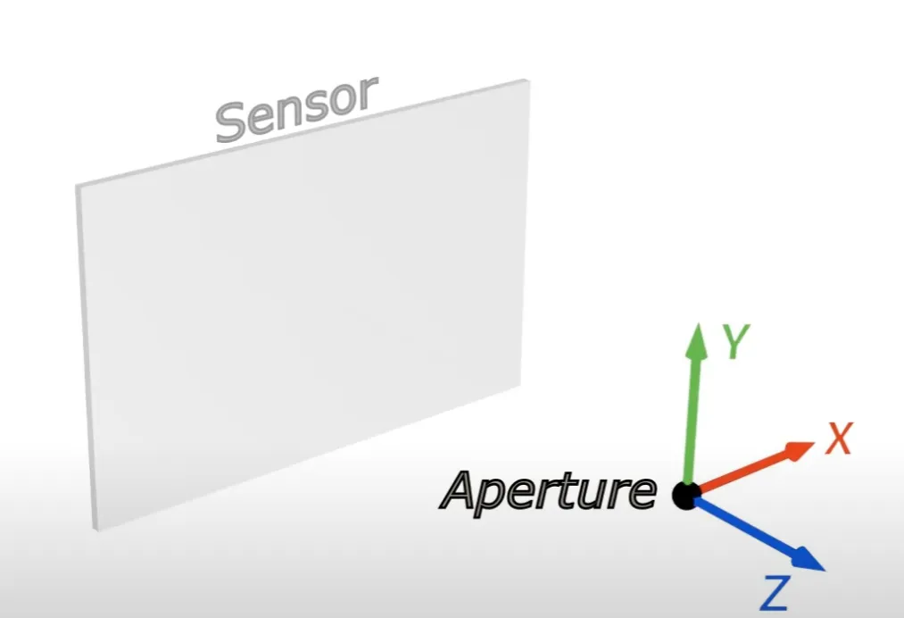

이제 위에서 본 구도를 살펴보며 x축과 z축을 보자.
이미지 평면과 조리개 사이의 거리를 초점 거리(focal length)라고 부릅니다.
여기서는 초점 거리를 대문자 F로 줄여 썼는데, 이는 단위가 밀리미터라는 것을 의미한다.
포착될 수 있는 양 극단의 광선 사이의 각도를 화각(angle of view)이라고 한다.
이 경우, 우리는 x축을 보고 있으므로 수평 화각(horizontal angle of view)을 나타내고 있다.

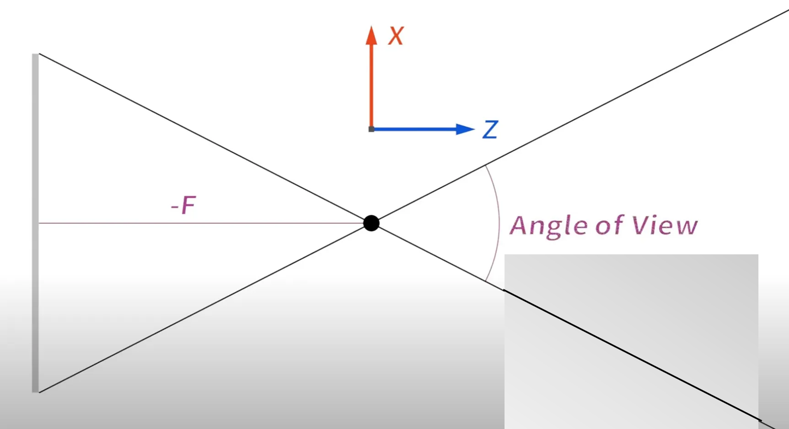

이제 여기 작은 정육면체의 모서리를 이루는 점의 사진을 찍고 싶다고 가정해 보자.
이 점의 x좌표를 대문자 X, Z좌표를 대문자 Z라고 부르자.
그리고 지금은 이 좌표들이 카메라의 좌표계로 주어졌다고 가정한다.
광선이 그 점에서부터 조리개를 통과하여 우리 센서에 닿을 것이다.

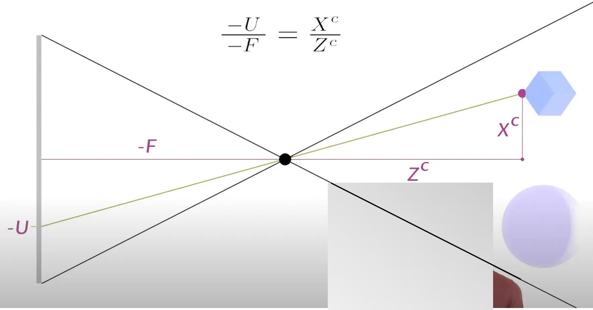

가장 먼저 알 수 있는 것은 이미지 상의 점이 조리개의 반대편에 있다는 것, 즉 음의 X좌표 값을 가진다는 것이다.
그 점을 -U라고 부르자. 마이너스를 붙임으로써 특정 경우에 U는 사실 양수가 되므로, X와 같은 부호를 갖게 된다.
꼭 이렇게 해야 하는 것은 아니지만, 이렇게 하면 수식이 조금 더 깔끔해진다.
닮은 삼각형의 원리를 통해 다음 식을 유도할 수 있다.

$$
\frac{-U}{-F} = \frac{X^C}{Z^C}
$$

이제 잠시 초점 거리가 두 배인 다른 핀홀 카메라를 생각해 보자.
만약 이미지 평면의 크기도 두 배로 늘리면, 우리는 다시 동일한 이미지를 얻게 된다.
따라서 우리는 동일한 이미지를 만들어내는 핀홀 카메라가 무수히 많다는 것을 알 수 있다.
우리는 왼쪽 항의 분자와 분모 양쪽에 계수 k를 추가하여 이것을 수식에 포함시킬 수 있다.
이것은 또한 초점 거리와 이미지 평면의 절대값은 이 수식에서 중요하지 않고,
오직 그들의 상대적인 값만이 중요하다는 것을 알려준다.
따라서 우리는 k를 자유롭게 선택할 수 있다.
그리고 사진을 다룰 때 보통 픽셀 단위로 작업하기 때문에, 거리가 픽셀로 표현되도록 k를 선택하는 것이 편리하다.

$$
\frac{-kU}{-kF} = \frac{X^C}{Z^C}
$$

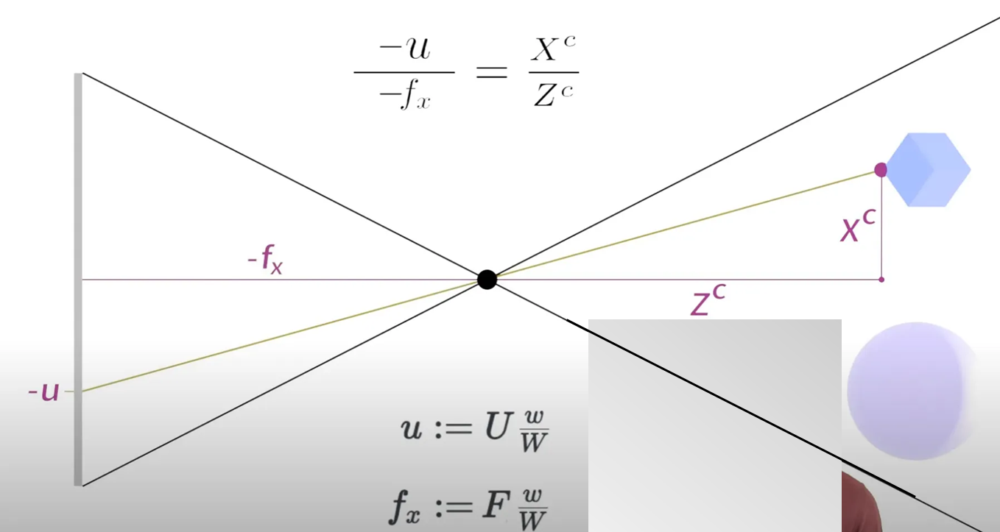

그럼 이미지 평면, 즉 센서의 너비를 픽셀 단위로 나타내기 위해 소문자 w를 사용한다.
그리고 k를 w/W, 즉 센서 너비(픽셀)를 센서 너비(밀리미터)로 나눈 값으로 설정할 수 있다.
이 계수는 밀리미터당 픽셀 수를 알려준다.
이제 좌측 상단의 값은 점의 이미지 좌표를 픽셀 단위로 나타낸 것이고,
아래쪽의 값은 픽셀 단위로 표현된 초점 거리이다.

$$
\frac{-u}{-f_x} = \frac{X^C}{Z^C}
$$

이제 센서가 광축과 완벽하게 정렬되지 않은 상황을 고려해 보자.
예를 들어, 센서가 x 방향으로 $u_0$만큼 벗어나 있다. 이 값은 이미 픽셀 단위로 주어졌다고 가정하자.
이 경우, 양의 x 방향으로의 센서 오프셋은 이미지 좌표를 더 음수 쪽으로 만들 것이므로,
-u는 $u_0$만큼 더 음수가 된다.
따라서 올바른 값을 얻기 위해 $u_0$를 다시 더해야 하고, 수식은 이렇게 된다.

$$
-u' = -u - u_{0}
$$

$$
-u = -u' + u_{0}
$$

$$
\frac{-u'+u_0}{-f_x} = \frac{X^C}{Z^C}
$$

Y 방향에 대해서도 동일한 방법을 적용하고, 아래와 같이 정리할 수 있다.

$$
uZ^{C} = f_{x}X^{C} + u_{0}Z^{C}
$$

$$
vZ^{C} = f_{y}Y^{C} + v_{0}Z^{C}
$$

 

$$
\begin{bmatrix}
Z^Cu \\
Z^Cv 
\end{bmatrix}
=
\begin{bmatrix}
f_x & 0 & u_0 \\
0 & f_y & v_0 
\end{bmatrix}
\begin{bmatrix}
X^C \\
Y^C \\
Z^C
\end{bmatrix}
$$

 

## 동차 좌표계(Homogeneous Coordinate System)

만약 우리가 데카르트 좌표 [x, y]를 가지고 있다면, 그에 해당하는 동차 좌표는 (xS, yS, S)이다.

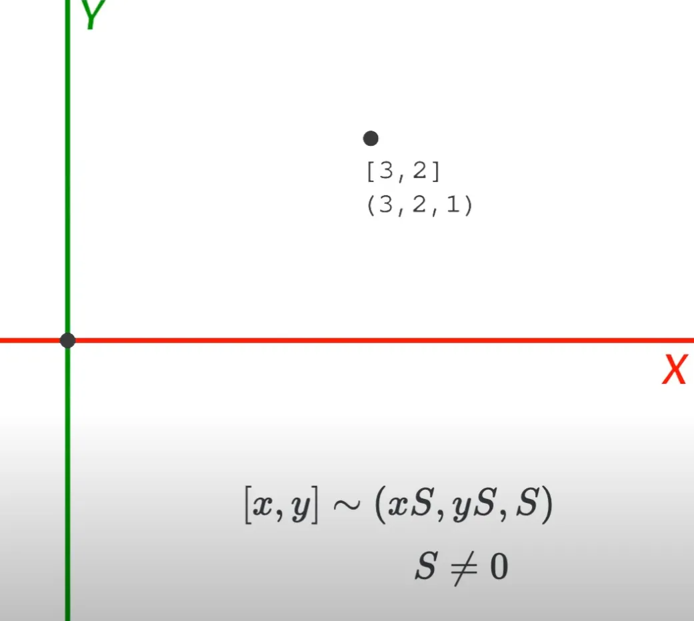

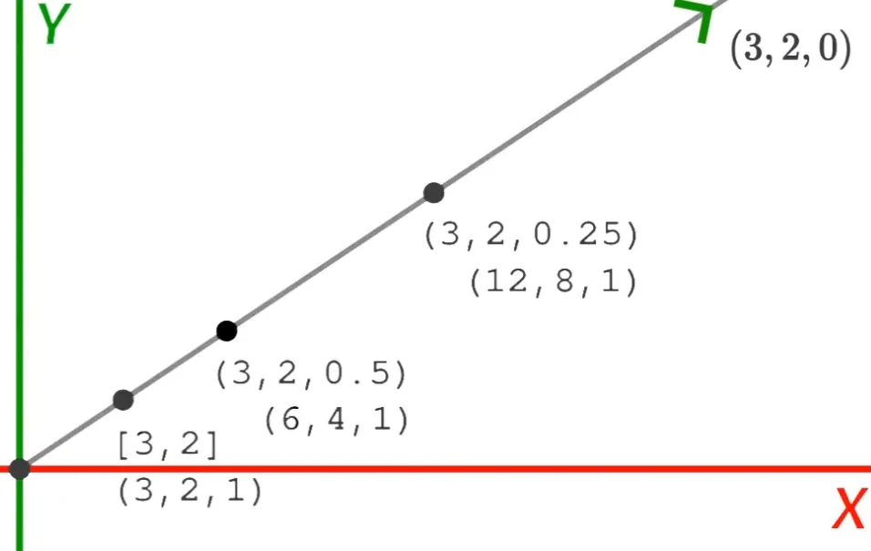

만약 데카르트 좌표에서 점을 회전하고 이동시키고 싶다면,
좌표에 회전 행렬을 곱한 다음 그 결과에 이동 벡터를 더해야 한다.
이것은 두 개의 개별적인 연산이다. 동차 좌표계에서는 이 두 가지 연산을 하나의 행렬 곱셈으로 모두 할 수 있다.
단지 좌측 상단 항목이 회전을, 마지막 열이 이동을 설명하는 행렬을 만들기만 하면 된다.
이제 회전과 이동 모두 하나의 연산으로 수행될 수 있고, 또한 단일 연산으로 역변환될 수 있어서 일이 더 쉬워진다.

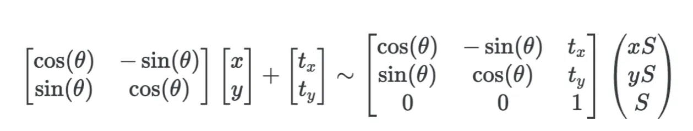

## 내부 파라미터 행렬(Intrinsic Matrix) 계속

동차 좌표계를 활용하여 내부 파라미터 행렬을 아래와 같이 나타낼 수 있다.

$$
\begin{bmatrix}
f_x & 0 & u_0 \\
0 & f_y & v_0 
\end{bmatrix}
\begin{bmatrix}
X^C \\
Y^C \\
Z^C
\end{bmatrix}
=
\begin{bmatrix}
Z^Cu \\
Z^Cv 
\end{bmatrix}
$$

$$
\begin{bmatrix}
f_x & 0 & u_0 \\
0 & f_y & v_0 \\
0 & 0 & 1
\end{bmatrix}
\begin{bmatrix}
X^C \\
Y^C \\
Z^C
\end{bmatrix}
=
\begin{bmatrix}
Z^Cu \\
Z^Cv \\
Z^C
\end{bmatrix}
$$

## 외부 파라미터 행렬(Extrinsic Matrix)

지금까지 X, Y, Z 좌표들이 이미 카메라의 좌표계로 주어졌다고 가정했다.
하지만 일반적으로 객체의 좌표는 카메라 좌표계가 아닌 월드 좌표계로 주어진다.
따라서 내부 파라미터 카메라 행렬을 적용하기 전에, 객체의 좌표를 월드 좌표계에서 카메라 좌표계로 변환해야 한다.

$$
\begin{bmatrix}
r_{11} & r_{12} & r_{13} & t_x \\
r_{21} & r_{22} & r_{23} & t_y \\
r_{31} & r_{32} & r_{33} & t_z 
\end{bmatrix}
\begin{bmatrix}
X^W \\
Y^W \\
Z^W \\
1
\end{bmatrix}
=
\begin{bmatrix}
X^C \\
Y^C \\
Z^C 
\end{bmatrix}
$$

## 좌표 변환(Coordinate Transformations)

목표는 World-to-Camera 행렬, 
즉 월드 좌표계의 좌표를 받아 그에 해당하는 카메라 좌표계의 좌표로 매핑하는 행렬을 찾는 것이다.

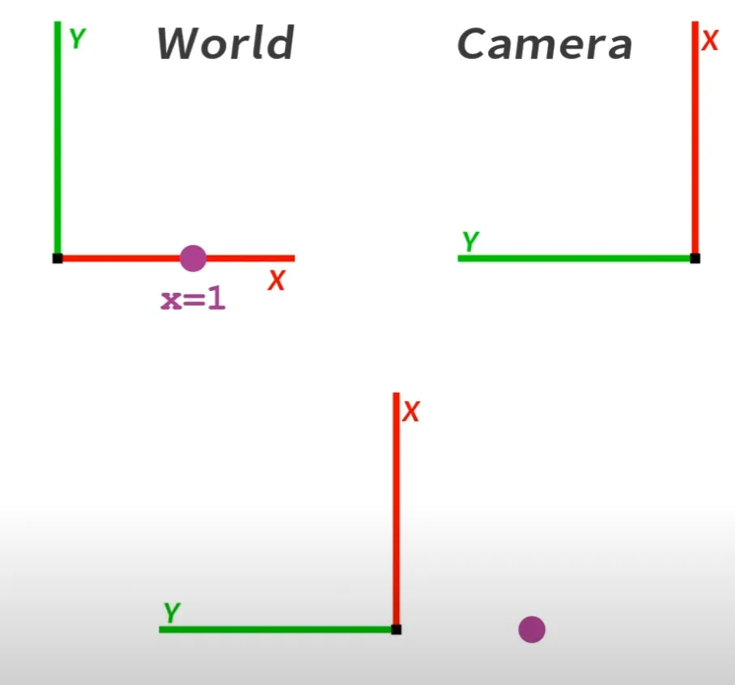

좌표계를 반시계 방향으로 회전시키는 것은 점의 좌표를 시계 방향으로 동일한 양만큼 회전시키는 것과 같은 효과를 가진다.
좌표계를 한 방향으로 변환하는 것은 객체의 좌표를 역방향으로 변환하는 것과 같다.
다르게 말하면, 만약 우리에게 좌표계가 어떻게 변하는지 알려주는 변환 행렬이 있다면,
그것의 역행렬은 객체의 좌표가 어떻게 변하는지를 알려준다.

## 외부 파라미터 행렬(Extrinsic Matrix) 계속

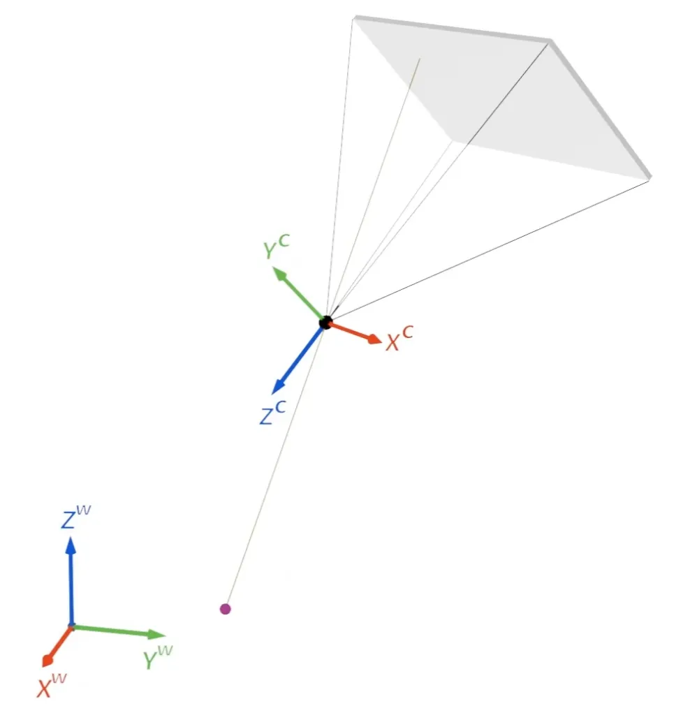

이 특정 예시에서는, 월드 좌표계에서 시작하여 카메라 좌표계로 가기 위해 월드 z축을 기준으로 약 ...도,
월드 y축을 기준으로 ...도, 월드 x축을 기준으로 ...도 회전시킨 다음, 
월드 x축을 따라 -...mm, 월드 y축을 따라 +...mm, 그리고 월드 z축을 따라 +...mm 이동시킨다.
이 변환들이 월드 축을 중심으로 일어난다고 명시적으로 언급한 이유는,
회전을 표현하는 다양한 방법이 있기 때문에 어떤 것을 이야기하고 있는지 명확히 해야 하기 때문이다.
만약 이 회전각들을 표준 오일러 회전 행렬에 대입하면, 이 회전 행렬을 얻게 된다.
그리고 이동 벡터는 간단하게 얻을 수 있다.

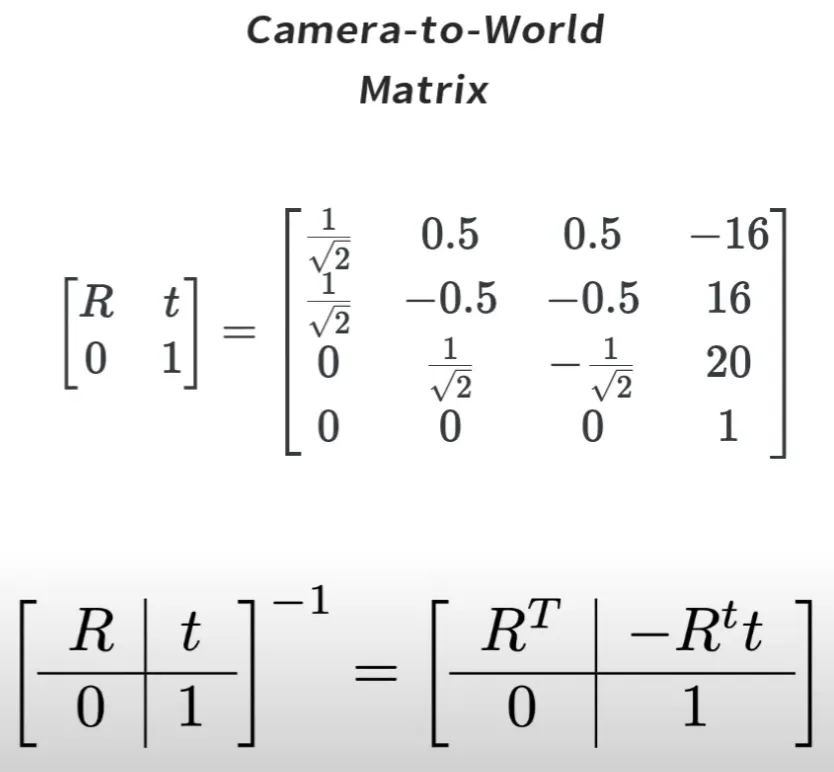

객체의 좌표에 대해서는 그 반대가 성립한다는 것을 알고 있다.
따라서, 이 행렬은 카메라 좌표계에 있는 객체의 좌표를 받아서 객체의 월드 좌표계 좌표로 매핑한다.
따라서 이것은 Camera-to-World 행렬이다. 하지만 우리는 World-to-Camera 행렬이 필요하다.
그리고 다행히도 World-to-Camera 행렬은 Camera-to-World 행렬의 역행렬일 뿐이다.

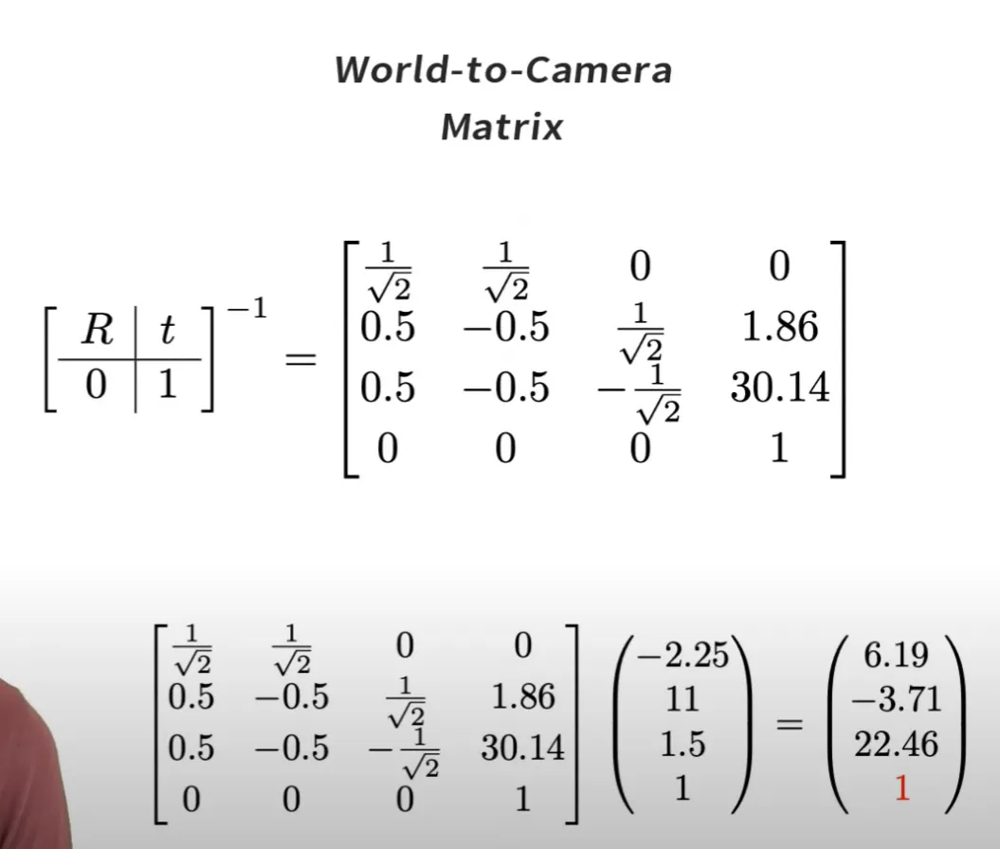

